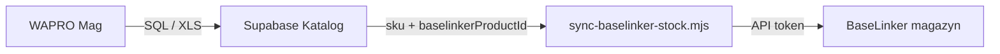

# BaseLinker — stan magazynowy i metka w katalogu

## Co już jest w katalogu

| Element | Opis |
|--------|------|
| **Import CSV** | `npm run import:baselinker` — produkty sklepu, w `product_meta.baselinkerProductId` |
| **Enrich Supabase** | `npm run import:baselinker-enrich` / `:apply` — opisy, waga, atrybuty z CSV do istniejących SKU ([mapowanie](./BASELINKER-EXPORT-MAPPING.md)) |
| **Metka „Base”** | Na karcie produktu, gdy jest `baselinkerProductId` (lub SKU typu BL…) |
| **Sync WAPRO** | Źródło prawdy dla **stanów i cen Mag** w Supabase (nie BaseLinker) |
| **Import brakujących z Mag** | `npm run import:wapro-mag` / `export:wapro-mag` — pełny Mag z XLS (bez pozycji **X**), szkielet: SKU, nazwa, ceny, stan |
| **Auto-import przy sync** | Po `npm run sync:wapro-stock` — dopina nowe SKU z `data/wapro-mag-catalog.json` (wyłącz: `WAPRO_AUTO_IMPORT=0`) |

### Mag WAPRO → pełny katalog (2026)

1. W WAPRO: eksport **Artykuły — przeglądanie** (XLS) do `Downloads`.
2. Lokalnie: `npm run export:wapro-mag` → `data/wapro-stock.csv` + `data/wapro-mag-catalog.json`.
3. Pierwsze uzupełnienie bazy: `npm run import:wapro-mag` (albo `import:wapro-missing:apply` z `--skeleton`).
4. Codziennie: sync stanów jak dotąd; **nowe indeksy** dopinają się same, jeśli JSON jest aktualny.

Na serwerze WAPRO: skopiuj `wapro-mag-catalog.json` obok `wapro-stock.csv` do `C:\katalog-sync\` po każdym eksporcie XLS z PC (albo rozszerz SQL o nazwę artykułu — wtedy JSON opcjonalny).

Oznaczenie w UI: tagi `wapro-import`, `do-uzupelnienia`, meta `waproSkeleton`, plakietka **Mag WAPRO** na karcie.

Wfsync słabo łączy towary — katalog może być **warstwą mapowania SKU ↔ ID BaseLinker**, o ile regularnie aktualizujecie eksport CSV albo API.

---

## Czy da się sync stanów Katalog → BaseLinker przez API?

**Tak, to realne i umiarkowany nakład pracy** (nie wymaga przepisywania wfsync).

BaseLinker: jeden endpoint `connector.php`, metoda m.in.:

- `getInventoryProductsList` / `getInventoryProductsData` — lista produktów magazynu BL
- `updateInventoryProductsStock` — **wgranie stanów** do wybranego magazynu (`inventory_id`)

### Proponowany przepływ (WAPRO = master)

1. W katalogu: stan z syncu WAPRO (już macie).
2. W `product_meta`: `baselinkerProductId` (z CSV lub skryptu mapującego).
3. Skrypt na PC lub serwerze ( **nie** w przeglądarce — token tajny):
   - czyta produkty z Supabase gdzie jest `baselinkerProductId`,
   - wysyła stany do BL (`updateInventoryProductsStock`).

### Co trzeba od Was

- **Token API** BaseLinker (Panel → Integracje → API).
- **`inventory_id`** magazynu BL (z listy magazynów w API).
- Decyzja: sync **tylko gdy różnica** stanu, batchami (BL ma limity).

### Nakład (szacunek)

| Etap | Praca |
|------|--------|
| Mapowanie SKU → ID (CSV / API) | już częściowo (import, import-wapro-missing) |
| Skrypt push stanów | ~1 dzień + testy |
| Harmonogram (Task Scheduler) | jak WAPRO sync |
| UI: filtr „bez Base”, ostatni sync BL | opcjonalnie +0.5 dnia |

**Nie** robimy pełnego tworzenia produktów w BL z katalogu w pierwszej iteracji — tylko **aktualizacja stanów istniejących powiązań**. Nowe towary nadal: Mag → katalog → ręcznie/CSV w BL albo osobna metoda API `addInventoryProduct` (więcej pracy).

---

## Pliki

- `scripts/sync-baselinker-stock.mjs` — szkielet (dry-run); wymaga `.env`:
  - `BASELINKER_TOKEN`
  - `BASELINKER_INVENTORY_ID`
- `scripts/import-baselinker-images-api.mjs` — **zdjęcia z API** (CDN `upload.cdn.baselinker.com`); CSV eksport nadal ma stare URL-e kenochem.com:
  - `npm run import:baselinker-images:api` — podgląd
  - `npm run import:baselinker-images:api:apply` — zapis Supabase + JSON + lite
  - Wymaga w `.env`: `BASELINKER_TOKEN`, `BASELINKER_INVENTORY_ID=17991` (magazyn „Kenochem główny”)
  - **Nie** podmienia kenochem.com na losowe URL-e z internetu — tylko gdy w magazynie BL jest już CDN Baselinker
- `scripts/import-baselinker-images.mjs` — uzupełnienie z CSV (tylko gdy w eksporcie jest już CDN)
- **kenochem.com:** po migracji WooCommerce nowe zdjęcia są pod `/wp-content/uploads/…`. Stare `/hpeciai/…` zwracają 404.
  - `npm run import:kenochem-shop-images` — podgląd (publiczne API sklepu)
  - `npm run import:kenochem-shop-images:apply` — zapis Supabase + JSON (uruchamiaj po migracji sklepu)
- `scripts/import-baselinker-images-api.mjs` — **tylko CDN Baselinker** z magazynu (nie nadpisuje nowych URL sklepu starymi linkami z BL)
- `scripts/fix-baselinker-images.mjs` — **naprawa zdjęć w magazynie BL** (martwe `/hpeciai/` → `/wp-content/uploads/` ze sklepu):
  - `npm run fix:baselinker-images` — podgląd
  - `npm run fix:baselinker-images:apply` — zapis do BaseLinker przez `addInventoryProduct`
  - Nie dotyka istniejących URL CDN BaseLinker; backup w `data/baselinker-image-backups/`
- `.env.example` — dopisz te zmienne gdy wdrożycie.

---

## Metka „w Base czy nie”

- **Jest w Base:** `baselinkerProductId` w meta (import CSV / import-wapro-missing / ręcznie w edycji).
- **Nie ma:** brak pola — można dodać filtr w katalogu „Bez BaseLinker” (kolejny krok).

Okresowe odświeżenie mapy: najprościej **cotygodniowy eksport** `Base__Produkty__*.csv` + skrypt uzupełniający brakujące `baselinkerProductId` po SKU (można dopisać do `import-wapro-missing` lub osobny `link-baselinker-ids.mjs`).
