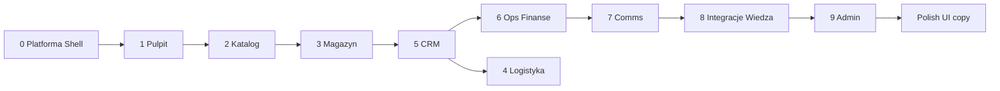

# Suite Kenochem — port hub-platform (1:1, jeden produkt)

## Efekt końcowy

**Jeden działający Suite** (`VITE_APP_PRODUCT=suite`, `https://kenochem-f4a5b.web.app`): ta sama idea co hub-platform — **jedna aplikacja, wszystkie segmenty**, sidebar/workspace, command palette, mobile nav.

- Każdy **segment** kopiujemy z huba i **dostosowujemy** do Kenochem (WAPRO, Supabase, role, dwa katalogi Akcesoria/Produkty, CRM w chmurze).
- **Drobne poprawki wizualne i copy** — na sam koniec, gdy wszystko działa jak tam.
- **Rozdzielanie** na osobne URL (katalog, sell, stock…) — **poza tym planem** (przyszłość); buildy produktów mogą istnieć, ale **nie są celem** tej pracy.

**Nie ruszamy (zostaje Kenochem):**

| Element | Gdzie w katalogu |
|---------|------------------|
| Sync stanów/cen **WAPRO** | `RefreshControls`, `stockSync.ts`, agent serwerowy |
| Produkty / stany w **Supabase** | `loadData`, skrypty import/sync |
| **CRM** klienci/zamówienia w Supabase | `src/lib/crm.ts` |
| Auth + role Kenochem | `auth`, `roles`, `adminAccess` |
| Discord webhook zamówień | env + istniejący flow |

**Referencja kodu huba:** `C:\Users\Biuro\Projects\hub-platform\apps\web\src`

---

## Sposób pracy (każdy segment)

1. Otwórz widok/komponent w hub-platform.
2. Skopiuj do `src/views/` lub `src/components/hub/` (nowy folder pod port).
3. Zamień importy: `@hub/module-catalog` → lokalne `Product`, `formatPricePln`, `CatalogFilterBar` itd.
4. Zamień dane demo huba (`DemoClient`, `clientsStore` demo) → **`CrmClient` + Supabase** tam, gdzie u nas już jest produkcja.
5. Podłącz segment w **`HubShell` + routing Suite** (docelowo zastępuje obecny header z przełącznikiem trybów w buildzie `suite` only).
6. Oznacz segment w tabeli poniżej: ✅ / 🔄 / ⏳.

---

## Segment 0 — Platforma (obowiązkowe przed resztą)

| Element hub | Pliki hub | Cel w katalogu | Status |
|-------------|-----------|----------------|--------|
| Typy nawigacji | `HubShell.tsx`, `lib/hubNavigation.ts` | `src/app/hubNavigation.ts` | ✅ |
| Shell (header, sidebar, mobile) | `HubShell.tsx`, `HubSidebar.tsx`, `MobileBottomNav.tsx` | `src/components/hub/*` | 🔄 |
| Nawigacja główna | `HubPrimaryNav.tsx`, `buildHubNavItems` | ten sam wzorzec, widoczność wg modułów Kenochem | ✅ |
| Preferencje nav | `lib/hubPreferences.ts` | port 1:1 (localStorage) | ✅ |
| Command palette | `HubCommandSearch.tsx`, `hubCommandItems.ts` | `HubCommandSearch` + Ctrl+K | ✅ |
| Powiadomienia | `NotificationCenter.tsx` | rozszerzyć `AppNotificationCenter` lub port | 🔄 |
| Motyw, avatar, profil | w `HubShell` | `useTheme`, `AppProfileMenu` — **ikony jak hub** | 🔄 |
| App entry Suite | `App.tsx` (hub) | `SuiteHubApp` + `main.tsx` gdy `APP_PRODUCT=suite` | ✅ |

**Kenochem:** bez multi-tenant / Stripe / `EntitlementsProvider` — jedna firma, jedna Supabase.

---

## Segment 1 — Pulpit (Home / Workspace)

| Hub | Plik | Kenochem | Status |
|-----|------|----------|--------|
| Workspace | `WorkspaceHubView.tsx` | Kafelki: Katalog, CRM, Magazyn, Operacje, Talk; skróty do lejka/koszyka | 🔄 |
| Home (moduły) | `HomeView.tsx` | Opcjonalnie prostszy pulpit modułów | ⏳ |

---

## Segment 2 — Katalog (Produkty)

| Hub | Plik | Kenochem | Status |
|-----|------|----------|--------|
| Lista + filtry | `CatalogView.tsx`, `CatalogFilterBar.tsx` | Już częściowo w `App.tsx` — **wpiąć w shell** | 🔄 |
| Ulubione, kits | `KitsView.tsx` | `KitsView` — jest | ✅ |
| Szczegóły produktu | `ProductDetail` (module-catalog) | `ProductDetail.tsx` | 🔄 |
| Lens / skaner | w hub App | `VisualSearchModal`, `BarcodeScanner` | ✅ |
| Sync odświeżenia | — | **WAPRO** w headerze shell (bez zmiany backendu) | ✅ |

**Kenochem:** dwa katalogi (Akcesoria / Produkty sklep) — zachować obecną logikę, UI jak hub (filtry w listach).

---

## Segment 3 — Magazyn (Warehouse)

| Hub | Plik | Kenochem | Status |
|-----|------|----------|--------|
| Magazyn hub | `WarehouseHubView.tsx` | Stany ±, etykiety, brak zdjęć, postęp foto | 🔄 |
| Lokalizacja regał | `warehouseLocation.ts` (module-catalog) | `warehouseLocation.ts` / `locationStore` — sprawdzić parity | 🔄 |
| Stock overrides | `stockOverridesStore` | jeśli brakuje — port | ⏳ |

---

## Segment 4 — Logistyka

| Hub | Plik | Kenochem | Status |
|-----|------|----------|--------|
| Logistyka | `LogisticsHubView.tsx` | Port; dostawy/trasy (lab jak w hub) | ⏳ |

---

## Segment 5 — CRM (Handel)

| Hub | Plik | Kenochem | Status |
|-----|------|----------|--------|
| CRM hub | `CrmHubView.tsx` | `CrmHubView.tsx` — tabs hub vs nasze | 🔄 |
| Lejek | `CrmPipelinePanel.tsx` | ✅ skopiowany + `leadsStore` | ✅ |
| Koszyk / oferta | order workspace w hub | `CrmOrderWorkspace` | ✅ |
| Klienci, NIP | hub + MF | `CrmClientsPanel` + Supabase | ✅ |
| Mapa, trasy | w hub CRM | `CrmMapRoutesView` | ✅ |
| Historia, prowizja | hub | commission + `CrmHistoryPanel` | ✅ |
| Zamówienia (statusy) | `OrdersHubView.tsx` | Port | ⏳ |
| Inbox | `CustomerInboxView.tsx` | **Wyłączone** (`CRM_INBOX_ENABLED`) do czasu decyzji poczty | ⏸️ |

**Kenochem:** lejek na razie localStorage → potem migracja `crm_leads` (nie blokuje UI 1:1).

---

## Segment 6 — Operacje i finanse

| Hub | Plik | Kenochem | Status |
|-----|------|----------|--------|
| Operacje | `OpsHubView.tsx` | `OpsHubView.tsx` — rozszerzyć do parity huba | 🔄 |
| Finanse | `FinanceHubView.tsx` | Marże, koszty, Excel export (skrypty py zostają) | ⏳ |
| Department suite | `DepartmentSuiteView.tsx` | Sprzedaż B2B / działy — port jeśli używane w hub demo | ⏳ |

---

## Segment 7 — Komunikacja

| Hub | Plik | Kenochem | Status |
|-----|------|----------|--------|
| Czat drawer | `ChatDrawer.tsx` | ✅ | ✅ |
| Team / comms | `CommsHubView.tsx`, `CommunityHubView.tsx`, `TeamView.tsx` | Port pełnego widoku team + emoji (Talk w shellu) | 🔄 |
| Kalendarz | `CalendarHubView.tsx` | Port | ⏳ |
| Assist | `AssistHubView.tsx` | Port (Gemini env już jest) | ⏳ |

---

## Segment 8 — Integracje, pobieranie, wiedza

| Hub | Plik | Kenochem | Status |
|-----|------|----------|--------|
| Integracje | `IntegrationsHubView.tsx` | Allegro/demo huba → tylko to, co realnie używamy | ⏳ |
| Do pobrania | `HubDownloadsView.tsx` | Pliki firmowe / instrukcje | ⏳ |
| Baza wiedzy | `HubGuideView.tsx`, `lib/hubGuide/*` | Instrukcje Kenochem (uproszczone) | ⏳ |

---

## Segment 9 — Admin

| Hub | Plik | Kenochem | Status |
|-----|------|----------|--------|
| Admin panel | `AdminControlPanelView.tsx` | `AdminHubPanel` + użytkownicy Supabase | 🔄 |

---

## Kolejność realizacji (tylko Suite)



Równolegle można: Segment 5 (CRM orders) gdy shell stoi.

---

## Definition of Done — Suite kompletny

- [ ] Logowanie → **Workspace** z działającymi kafelkami do wszystkich segmentów.
- [ ] **Sidebar / mobile nav** — wszystkie segmenty z tabeli (poza ⏸️ inbox), przełączanie bez przeładowania strony.
- [ ] **Katalog + magazyn** — w tym **sync WAPRO** z UI jak dziś.
- [ ] **CRM** — koszyk, klienci Supabase, mapa, **lejek**, historia; orders hub jak w hub-platform.
- [ ] **Ops/Finanse** — parity z hub (w granicach danych Kenochem).
- [ ] **Comms** — czat realtime + widok zespołu w shellu.
- [ ] **Admin** — użytkownicy i ustawienia.
- [ ] Deploy: `npm run build:suite` + `hosting:suite` — jeden URL produkcyjny dla zespołu.

---

## Świadomie pomijamy z huba (lab SaaS)

Multi-tenant provisioning, Stripe / ProductPaywall, tenant switcher, preview tenant YAML — **nie kopiujemy**, chyba że później explicit request.

---

## Komendy

```bash
npm run dev:suite
npm run build:suite
npx firebase deploy --only hosting:suite
```

Powiązane: [ROADMAP.md](./ROADMAP.md), [ARCHITECTURE.md](./ARCHITECTURE.md).
